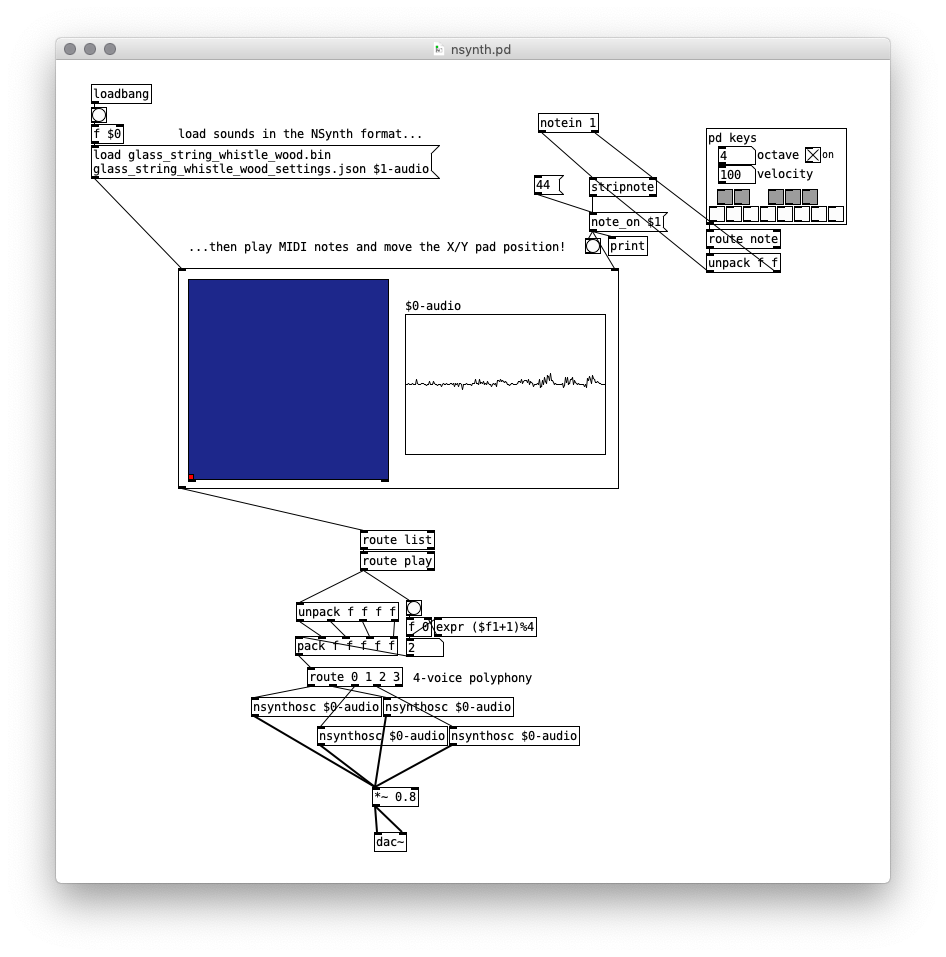

# NSynth: neural audio synthesis

NSynth is an algorithm for synthesizing musical notes using deep neural networks. It presents a data-driven approach to synthesis, where the neural network learns a [latent space](https://towardsdatascience.com/understanding-latent-space-in-machine-learning-de5a7c687d8d) of the timbre and dynamics of existing sounds — that is, a compressed data representation based on features inferred from the data. A trained NSynth model can encode arbitrary input sounds into the latent representation, perform transformations (e.g. interpolation) in the latent space and decode back to audio.

NSynth is based on the WaveNet generative model, which was originally designed for speech synthesis and yielded results surpassing previous state-of-the-art techniques. NSynth introduces an autoencoder structure with the goal to eliminate WaveNet's need for external conditioning and to enable interpolation between different timbres.

NSynth is also the name of a dataset of musical note samples for training neural networks, published along with the algorithm. It includes hundreds of thousands of notes from about 1000 instruments, tagged with metadata about pitch, velocity, instrument type and sonic qualities.

## WaveNet

WaveNet, proposed by Google DeepMind in 2016, models a conditional probability distribution where each audio sample is conditioned on all previous samples. It is built from causal convolutions, which are like regular convolutions, but shifted in time such that each output sample only depends on past samples. Causal convolutions require a large amount of layers to increase the receptive field, i.e. the number of previous samples considered when generating new samples. This in turn increases computational cost, limiting the ability of the network to model long-term structure efficiently.

To increase the receptive field with a substantially lower computational cost, WaveNet uses dilated convolutions. A dilated convolution has "holes", i.e. it skips over some number of steps (the *dilation*) between input samples. In WaveNet, the dilation is doubled for each convolution layer, allowing the receptive field to grow exponentially with the depth of the network.


Even with dilated convolutions, the computational cost for generating high-quality audio is still prohibitive. As a compromise, WaveNet works with 16000 Hz, 8-bit samples. µ-law companding is used to reduce quantization noise at the expense of dynamic range.

Google did not publish their WaveNet code, but several free and open source implementations are available online.

### More on WaveNet

- [WaveNet: A Generative Model for Raw Audio](https://deepmind.com/blog/article/wavenet-generative-model-raw-audio) (blog, audio examples)
- [WaveNet: A Generative Model for Raw Audio](https://arxiv.org/abs/1609.03499) (paper)
- [WaveNet: Increasing reception field using dilated convolution](https://medium.com/@kion.kim/wavenet-a-network-good-to-know-7caaae735435) (blog)
- [Reading notes: Pixel CNN, Wavenet, Language modeling with GCNN (Brief)](https://ruotianluo.github.io/2017/01/11/pixelcnn-wavenet/) (blog)

## NSynth

NSynth, published by Magenta in 2017, is motivated in part by WaveNet's inability to model long-term structure (more than ~500 ms) without external conditioning. It adapts WaveNet into an autoencoder model consisting of a WaveNet-like encoder and a WaveNet decoder.

The encoder is described in the NSynth paper as follows:

*"The temporal encoder model is a 30-layer nonlinear residual network of dilated convolutions followed by 1x1 convolutions. Each convolution has 128 channels and precedes a ReLU nonlinearity. The output feed into another 1x1 convolution before downsampling with average pooling to get the encoding Z."*

From this encoding, the decoder reconstructs audio sample by sample. The network is also conditioned on a one-hot representation of pitch, allowing pitch to be controlled during generation.


The NSynth algorithm is very computationally intensive and much too slow for real-time synthesis. However, it has been adapted into an interactive instrument in the form of the Open NSynth Super. Sounds are generated in advance for each interpolated position between four different instruments and loaded onto the Open NSynth Super device, allowing the interpolation space to be explored using the touch pad.

The [SOPI fork of Open NSynth Super](https://github.com/SopiMlab/open-nsynth-super/) has instructions for generating audio with NSynth. Note that this requires a powerful GPU (ideally multiple).

Some of the sounds we've generated are available in the [SOPI Google Drive](https://drive.google.com/open?id=1yoJhvr2UY0ID3AP6jumUItJJGSkiBEg_). The `glass_string_whistle_wood` files shown in the example below are in the `inspace.zip` package.

We have also developed a Pure Data patch for playing notes generated by NSynth (`nsynth.pd`). To run this, you need to

- [Set up pyext](../../utilities/pyext-setup/)
- Install the `unauthorized` Pd external (Help menu → Find externals)



The heart of the patch is the Python file `nsynth.py`, which defines two classes that are used as `pyext` objects in the patch (inside the subpatch containing the X/Y pad and `$0-audio` array). The `loader` is responsible for loading the audio generated by NSynth from the `.bin` file into the Pd array, using information in the settings `.json` file. The notes are stored back to back in a single array. For each incoming MIDI note, the `controller` then calculates start, end, duration and onset values for `tabread4~` (inside the `nsynthosc` abstraction) to play back the correct note.


## Generating Audio with NSynth in Azure My Virtual Machines

Log in to  https://labs.azure.com
(see the  [login instructions](https://github.com/SopiMlab/DeepLearningWithAudio/blob/master/00_introduction/))

c/p the command line below into your ternimnal window to go to the dlwa directory

```
cd /data/dome5132fileshare/DeepLearningWithAudio/utilities/dlwa
```


**TRANSFERING YOUR DATASET TO THE VIRTUAL MACHINE**

You can transfer your files from your own PC to the vm following the below command line structure. Open a new terminal window make sure that you are in your own computer/laptop directory

* Transfering a folder

```
scp -P 63635 -r input_folder e5132-admin@ml-lab-00cec95c-0f8d-40ef-96bb-8837822e93b6.westeurope.cloudapp.azure.com:/data/dome5132fileshare/DeepLearningWithAudio/utilities/dlwa/inputs/your_name 
```

* Transfering a file
```
scp -P 63635 input_name.wav e5132-admin@ml-lab-00cec95c-0f8d-40ef-96bb-8837822e93b6.westeurope.cloudapp.azure.com:/data/dome5132fileshare/DeepLearningWithAudio/utilities/dlwa/inputs/your_name
```

Please note that the text **"63635"** in the command line above should be changed with your personal info. You can find it in the ssh command line in the pop up connect window. (see the  [login instructions](https://github.com/SopiMlab/DeepLearningWithAudio/blob/master/00_introduction/))

**input_folder** and should be replaced with your directory path in your own machine as well as the folder **your_name**. 
Please note that the name you give to **input_folder** will be used in below command lines as well.


**PREPARING YOUR DATASET**

```
./dlwa.py nsynth prepare --input_name your_name/nsynth --output_name your_name/nsynth
```
**your_name/nsynth** and  **your_name/nsynth** should be replaced with your own folder names. Saves the files into DeepLearningWithAudio/utilities/dlwa/inputs/your_name/nsynth (It will create the folder **your_name/nsynth**, don't need to create it before)


**STARTING GENERATING AUDIO SAMPLES**

```
./dlwa.py nsynth generate --input_name your_name/nsynth --output_name your_name/nsynth --gpu 1
```
**your_name/nsynth** and  **your_name/nsynth** should be replaced with your own folder names. 
This command line will start generating the audio samples and and it will save trained checkpoints into DeepLearningWithAudio/utilities/dlwa/models/nsynth/**your_name/nsynth** folder


**MONITORING THE TRAINING**

It is most likely that GANSynth training will take approximatley 48 hours, during which you can log in and monitor the status of your training. To do that;

Log in to  https://labs.azure.com
(see the  [login instructions](https://github.com/SopiMlab/DeepLearningWithAudio/blob/master/00_introduction/))

c/p the command line below into your ternimnal window to go to the dlwa directory

```
cd /data/dome5132fileshare/DeepLearningWithAudio/utilities/dlwa
./dlwa.py util screen-attach
```

If your **audio generation still continues**, you will see similar output on your termninal window :

```
/data/dome5132fileshare/DeepLearningWithAudio/utilities/dlwa/outputs/nsynth/chouteau/nsynth/workdir/audio_output/batch0/gen_keyboardelectronic_0.047_organelectronic_0.596_pitch_60_reedacoustic_0.357.wav
I0413 13:17:32.301989 139917840717632 fastgen.py:175] Saving: /data/dome5132fileshare/DeepLearningWithAudio/utilities/dlwa/outputs/nsynth/chouteau/nsynth/workdir/audio_output/batch0/gen_keyboardelectronic_0.047_organelectronic_0.596_pitch_60_reedacoustic_0.357.wav
INFO:tensorflow:Saving: /data/dome5132fileshare/DeepLearningWithAudio/utilities/dlwa/outputs/nsynth/chouteau/nsynth/workdir/audio_output/batch0/gen_keyboardelectronic_0.047_organelectronic_0.596_pitch_64_reedacoustic_0.357.wav
I0413 13:17:33.942848 139917840717632 fastgen.py:175] Saving: /data/dome5132fileshare/DeepLearningWithAudio/utilities/dlwa/outputs/nsynth/chouteau/nsynth/workdir/audio_output/batch0/gen_keyboardelectronic_0.047_organelectronic_0.596_pitch_64_reedacoustic_0.357.wav
```

If your **audio generation is completed**, you will see the below text on your terminal window :

```
script failed: attach dlwa screen
aborting
```


**TRANSFERING YOUR GENERATED AUDIO MODEL TO YOUR OWN COMPUTER/LAPTOP**

You can transfer your files, such as trained models from your the virtual machine to your on own PC  following the below command line structure. Open a new terminal window make sure that you are in your own computer/laptop directory.

* Transfering a folder

```
scp -P 63635 -r e5132-admin@ml-lab-00cec95c-0f8d-40ef-96bb-8837822e93b6.westeurope.cloudapp.azure.com:/data/dome5132fileshareDeepLearningWithAudio/utilities/dlwa/models/nsynth/your_name/nsynth ~/Downloads
```

Please note that the text **"63635"** in the command line above should be changed with your personal info. You can find it in the ssh command line in the pop up connect window. (see the  [login instructions](https://github.com/SopiMlab/DeepLearningWithAudio/blob/master/00_introduction/))

**your_name/nsynth** and should be replaced with your directory path in your own machine. 


### More on NSynth

- [NSynth: Neural Audio Synthesis](https://magenta.tensorflow.org/nsynth) (blog, audio examples)
- [Neural Audio Synthesis of Musical Notes with WaveNet Autoencoders](https://arxiv.org/abs/1704.01279) (paper)
- [NSynth](https://github.com/tensorflow/magenta/tree/master/magenta/models/nsynth) (code)
- [The NSynth Dataset](https://magenta.tensorflow.org/datasets/nsynth)
- [Open NSynth Super](https://github.com/googlecreativelab/open-nsynth-super)

## Exercises

### 1. Experiment with nsynth.pd

Load some sounds into `nsynth.pd` and explore how they change by moving the position on the X/Y pad. If you don't have a MIDI input, you can manually send `note_on <pitch>` messages to the second inlet of the subpatch containing the X/Y pad.

Investigate the structure of the patch. What kind of alternative ways of interacting with the sounds can you come up with?

### 2. (optional) Generate sounds

If you'd like to use your own sounds to generate with NSynth, you can follow the [Open NSynth Super audio pipeline](https://github.com/SopiMlab/open-nsynth-super/tree/master/audio) guide.

Note that this requires a powerful GPU (ideally multiple) and generally takes several days.
