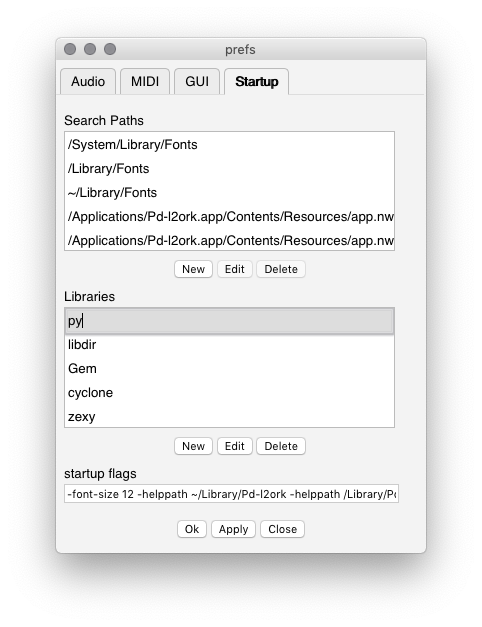

# GANSynth (Mac)

## Prerequisites

You should have [Purr Data](https://agraef.github.io/purr-data/) installed. Pd vanilla may work too, but the setup will be slightly different and we have not tested it.

## Install Xcode command line tools

Apple's Xcode command line developer tools are required for setup. If you have the regular Xcode installed from App Store, the command line tools should already be included.

To install the command line tools, open Terminal and run:

```
$ xcode-select --install
```

This will pop up a dialog to guide you through the installation.

## Install Conda

Install Miniconda, following the [official instructions](https://conda.io/projects/conda/en/latest/user-guide/install/macos.html).

## Download Magenta

Enter the root directory of the course repository, for example:

```
$ cd ~/Code/DeepLearningWithAudio2019
```

Clone our Magenta code:

```
$ git clone https://github.com/SopiMlab/magenta.git
```

Enter the newly created Magenta directory:

```
$ cd magenta
```

## Install Magenta

If your computer has an NVIDIA GPU, you can use `magenta-gpu` instead of `magenta` to significantly speed up computations.

### GPU version

TODO

### CPU version

Create a Conda environment (named "magenta" here):

```
$ conda create -n magenta python=2.7 libopenblas=0.3
```

Activate the environment:

```
$ conda activate magenta
```

Install Magenta from the current directory using pip, Python's package manager:

```
$ pip install .
``` 

You should now see Magenta in the output of `pip list`:

```
$ pip list
Package                            Version
---------------------------------- -----------
...
magenta                            1.1.2
...
```

## Download GANSynth checkpoint

Enter the `gansynth` directory:

```
$ cd ../gansynth
```

Download Google's pretrained checkpoint:

```
$ curl -LO https://storage.googleapis.com/magentadata/models/gansynth/all_instruments.zip
```

Extract the zip:

```
$ unzip all_instruments.zip
```

(They also have an [acoustic_only](https://storage.googleapis.com/magentadata/models/gansynth/acoustic_only.zip) checkpoint)

Feel free to remove the zip file at this point.

## Verify that GANSynth is working

Generate some random notes:

```
$ gansynth_generate --ckpt_dir=all_instruments --output_dir=output
```

This should produce a few wav files in the `output` subdirectory.

## Build pyext

Enter the `pyext-setup` directory:

```
$ cd ../pyext-setup
```

Run the `build.py` script with the `--info` flag to check your environment:

```
$ python build.py --info
Python version: 2.7.16 |Anaconda, Inc.| (default, Aug 19 2019, 18:51:18) 
[GCC 4.2.1 Compatible Clang 4.0.1 (tags/RELEASE_401/final)]
Python executable: /Users/miranda/miniconda3/envs/magenta/bin/python
Pd path: /Applications/Pd-l2ork.app
Pd variant: Purr Data
Conda root: /Users/miranda/miniconda3/envs/magenta
```

If the script fails to find your Pd path, or finds the wrong version, you can specify it manually with the `--pd` option:

```
$ python build.py --info --pd /Users/miranda/SomeUnusualPdFolder/Pd-l2ork.app
Python version: 2.7.16 |Anaconda, Inc.| (default, Aug 19 2019, 18:51:18) 
[GCC 4.2.1 Compatible Clang 4.0.1 (tags/RELEASE_401/final)]
Python executable: /Users/miranda/miniconda3/envs/magenta/bin/python
Pd path: /Users/miranda/SomeUnusualPdFolder/Pd-l2ork.app
Pd variant: Purr Data
Conda root: /Users/miranda/miniconda3/envs/magenta
```

Now build pyext by running the same command without `--info` (keep the `--pd` option if you needed to add it before):

```
$ python build.py
```

This creates a binary called `py.pd_darwin` in the `build/py` subdirectory.

## Install pyext

Create a directory in your Library for Purr Data externals:

```
$ mkdir -p ~/Library/Pd-l2ork
```

(In case the directory already exists, this command will do nothing, so it's safe to run either way.)

Move `py.pd_darwin` into the newly created directory:

```
$ mv build/py/py.pd_darwin ~/Library/Pd-l2ork/
```

Start Purr Data. Go to Edit → Preferences → Startup and add `py` to the libraries list:



Save the preferences by clicking Ok and restart Purr Data. There should be a message about pyext in the main window, e.g.:

```
------------------------------------------------
py/pyext 0.2.2 - python script objects
(C)2002-2015 Thomas Grill - http://grrrr.org/ext

using Python 2.7.16 |Anaconda, Inc.| (default, Aug 19 2019, 18:51:18) 
[GCC 4.2.1 Compatible Clang 4.0.1 (tags/RELEASE_401/final)]

Python array support enabled
------------------------------------------------
```

Congratulations, you've got it working!

You should now be able to open `gansynth.pd` in Purr Data. It will take a moment to load, during which the program may appear to be idle.