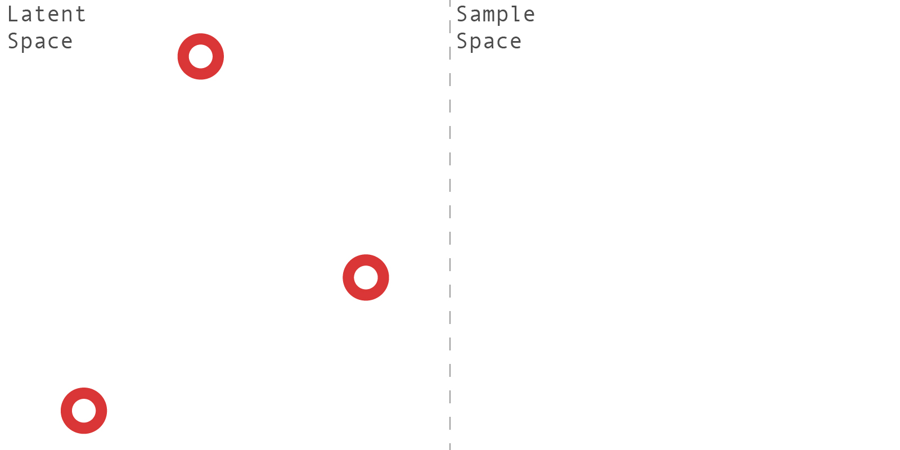

## GANSynth Hallucination

The word "hallucination" originates from the latin term _alucinari_ meaning "to wander in the mind". A modern definition would be "a perception in the absence of external stimulus that has qualities of real perception". These perceptions can take many form such as visual, auditory and tactile.

In machine learning, hallucination like effects have been explored mainly with images and video. Machine learning has been used to generating novel examples based on learned patters [at least since 1988](https://ieeexplore.ieee.org/document/23933), but it became popular with the wider public in 2015 through the release of Google's DeepDream. DeepDream detects and enhances features based on what it learned, allowing it go generate images such as the one below.

Later on, Generative Adversarial Networks (GANs) were applied to interpolate between known points in latent space to generate smooth, hallucinatory transitions between images. An example of this from the art world can be seen in [Refik Anadol's work](https://www.instagram.com/p/B0ScHswlbIe/?igshid=1i7r15rt4b2va).

Here we have strived to similarly apply GANs to create auditory hallucinations.

### How it works

The process starts by randomly selecting a number of points in latent space. How many points are selected depends on the `NoteCount` parameter. In this example `NoteCount = 3`.

The process then interpolates between these primary points, evenly selecting secondary points on the path between the primary points. How many secondary points are selected depends on the `InterpolationSteps` parameter. In this example `InterpolationSteps = 3`.

These latent space coordinates are then fed into the GANSynth model, which generates as many samples as there are points. An envelope is also applied to the generated samples based on the `StartTrim`, `Attack`, `Sustain` and `Decay` parameters.

The samples are then merged to create the final hallucination. How much these samples overlap depends on the `SampleSpacing` parameter.

### Initial Setup

*Note:* You will need to have the externals `zexy` and `list-abs` installed.

1. Open `gansynth_hallucination.pd` in Pure Data.
2. Once opened, the gansynth model will start loading. Wait until you see "gansynth_worker is ready" in the console before proceeding with the exercises.

### Exercise 1

We will start off by generating a simple hallucination.

1. Leave the parameters as is and press "Generate" to generate a hallucination.
2. The generating will take at least 10 seconds (in the later exercises, depending on the parameters, if might take up to a minute or two). Once completed, you will see the waveform in the `$0-sound` array.
3. You can play the sound by clicking "Play".

### Exercise 2

In this exercise we generate a hallucination between two points in latent space, but configure it so that the hallucinated samples aren't faded into each other. This will give you a better picture of how the interpolated hallucination samples change over time.

1. Change the parameters to the following:
    NoteCount = 2
    InterpolationSteps = 4
    SampleSpacing = Max (usually 5)
    StartTrim = 0
    Attack = 0
    Sustain = Max (usually 4)
    Decay = 0
2. Click "Generate" to create the sample.

What you will end up with a hallucination of 6 samples with a constant envelope, each sample separated by a second of silence.

Listen to the samples and notice how they change. Is the transition smooth? Or do the hallucination suddenly sound very different between two samples?

### Exercise 3

In this exercise you will change the GANSynth training checkpoint to generate different sounding hallucinations.

1. Download a checkpoint and make sure the folder you downloaded is in the same directory as the PD patch.
2. Edit the `load ` message in the PD patch to be `load NAME_OF_FOLDER`.
3. In execute mode, click the message to trigger the loading.
4. Wait until the model is done loading.
5. Play around with the parameters and generate different kinds of samples.