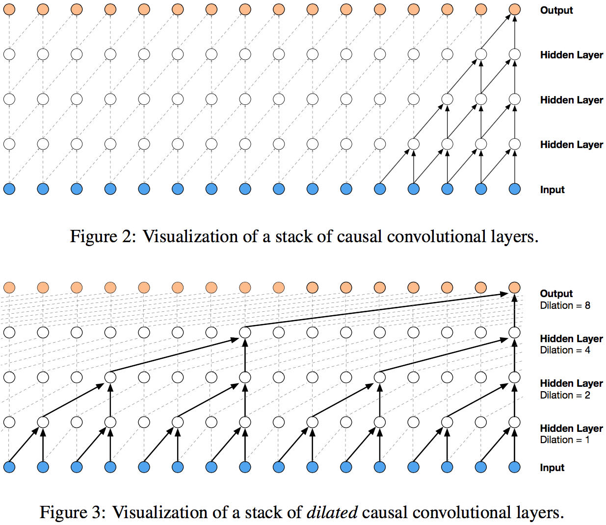
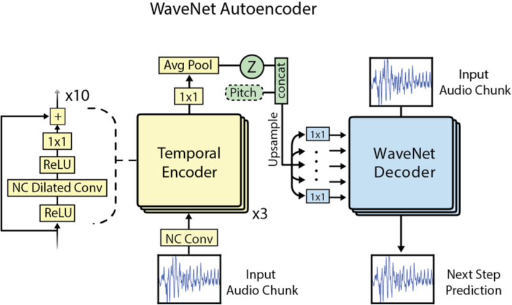

# NSynth: neural audio synthesis

NSynth is an algorithm for synthesizing musical notes using deep neural networks. It presents a data-driven approach to synthesis, where the neural network learns to represent the timbre and dynamics of existing sounds in a compressed latent space. From this representation, it can then reconstruct the sounds, as well as perform semantic interpolation between different timbres to create novel sounds.

NSynth is based on the WaveNet generative model, which was originally designed for speech synthesis and yielded results surpassing previous state-of-the-art techniques. NSynth introduces an autoencoder structure with the goal to eliminate WaveNet's need for external conditioning and to enable interpolation between different timbres.

NSynth is also the name of a dataset of musical note samples for training neural networks, published along with the algorithm. It includes hundreds of thousands of notes from about 1000 instruments, tagged with metadata about pitch, velocity, instrument type and sonic qualities.

TODO: latent representations, what does encoding/decoding mean here, what is NN

## WaveNet

WaveNet, proposed by Google DeepMind in 2016, models a conditional probability distribution where each audio sample is conditioned on all previous samples. It is built from causal convolutions, which are like regular convolutions, but shifted in time such that each output sample only depends on past samples. Causal convolutions require a large amount of layers to increase the receptive field, i.e. the number of previous samples considered when generating new samples. This in turn increases computational cost, limiting the ability of the network to model long-term structure efficiently.

To increase the receptive field with a substantially lower computational cost, WaveNet uses dilated convolutions. A dilated convolution has "holes", i.e. it skips over some number of steps (the *dilation*) between input samples. In WaveNet, the dilation is doubled for each convolution layer, allowing the receptive field to grow exponentially with the depth of the network.

Even with dilated convolutions, the computational cost for generating high-quality audio is still prohibitive. As a compromise, WaveNet works with 16000 Hz, 8-bit samples. µ-law companding is used to reduce quantization noise at the expense of dynamic range.

TODO: gated activation units, residual/skip connections, conditioning?

Google did not publish their WaveNet code, but several free and open source implementations are available online.

TODO: audio examples

## NSynth

NSynth, published by Magenta in 2017, is motivated in part by WaveNet's inability to model long-term structure (more than ~500 ms) without external conditioning. It adapts WaveNet into an autoencoder model consisting of a WaveNet-like encoder and a WaveNet decoder.

The encoder is described in the NSynth paper as follows:

*"The temporal encoder model is a 30-layer nonlinear residual network of dilated convolutions followed by 1x1 convolutions. Each convolution has 128 channels and precedes a ReLU nonlinearity. The output feed into another 1x1 convolution before downsampling with average pooling to get the encoding Z."*

From this encoding, the decoder reconstructs audio sample by sample. The network is also conditioned on a one-hot representation of pitch, allowing pitch to be controlled during generation.

The NSynth algorithm is very computationally intensive and much too slow for real-time synthesis. However, it has been adapted into an interactive instrument in the form of the Open NSynth Super. Sounds are generated in advance for each interpolated position between four different instruments and loaded onto the Open NSynth Super device, allowing the interpolation space to be explored using the touch pad.

For those with access to powerful GPUs, we have instructions on how to generate audio. TODO: link

TODO: audio exercises

## Exercises

### 1. Group generation

Using whatever kind of instrument you prefer, record 4-second samples of each of the following notes: C2, E2, G#2, C3, E3, G#3, C4 (MIDI notes 24, 28, 32, 36, 40, 44, 48).

Convert the samples to 16000 Hz sample rate, 16-bit signed integer. Make sure they're **exactly** 4 seconds long (64000 samples). Note that the low sample rate means your sounds will lose all frequencies above 8000 Hz, so don't waste time on making super detailed highs! Name your samples with the instrument name and note number separated by an underscore, e.g. `sandstormlead_24.wav`.

We will collect the samples in groups of four and run the audio generation scripts on Aalto Science-IT's Triton cluster. This will take a few days, after which we will load the samples onto Open NSynth Super devices and explore the generated sounds.

## Links

- [WaveNet: A Generative Model for Raw Audio](https://deepmind.com/blog/article/wavenet-generative-model-raw-audio) (blog)
- [WaveNet: Increasing reception field using dilated convolution](https://medium.com/@kion.kim/wavenet-a-network-good-to-know-7caaae735435) (blog)
- [WaveNet: A Generative Model for Raw Audio](https://arxiv.org/abs/1609.03499) (paper)
- [NSynth: Neural Audio Synthesis](https://magenta.tensorflow.org/nsynth) (blog)
- [Neural Audio Synthesis of Musical Notes with WaveNet Autoencoders](https://arxiv.org/abs/1704.01279) (paper)
- [NSynth](https://github.com/tensorflow/magenta/tree/master/magenta/models/nsynth) (code)
- [The NSynth Dataset](https://magenta.tensorflow.org/datasets/nsynth)
- [Open NSynth Super](https://github.com/googlecreativelab/open-nsynth-super)
