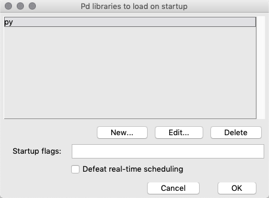

# pyext setup (macOS)

## Prerequisites

You should have [Pure Data](https://puredata.info/) installed. We've found Purr Data to be unreliable for this setup, so Pd Vanilla is preferred.

If you've never used the command line before, it may be a good idea to have a look at a [tutorial](https://macpaw.com/how-to/use-terminal-on-mac) first to learn some of the basics.

## Install Xcode command line tools

Apple's Xcode command line developer tools are required for setup. If you have the regular Xcode installed from App Store, the command line tools may already be included.

To install the command line tools, open Terminal and run:

```
xcode-select --install
```

This will pop up a dialog to guide you through the installation.

## Clone the course repository

If you don't already have this repository on your computer, clone it:

```
git clone https://github.com/SopiMlab/DeepLearningWithAudio.git
```

This will download the repository into your current working directory, which in a new terminal window is your home directory.

## Install Conda

We will use the Conda package/environment manager to set up a Python environment.

If you use [Homebrew](https://brew.sh), you can simply run:

```
brew cask install miniconda
```

Otherwise, follow the [official Conda instructions](https://conda.io/projects/conda/en/latest/user-guide/install/macos.html). Note that you *only* need Miniconda! The instructions page is a bit confusing and makes it seem like you should install both Miniconda and Anaconda, but you can ignore the latter.

## Download Magenta

Enter the root directory of the course repository. For example, if you cloned it into your home directory:

```
cd ~/DeepLearningWithAudio
```

Now clone our Magenta repository:

```
git clone https://github.com/SopiMlab/magenta.git
```

## Install Magenta

Magenta can run either on CPU (widest hardware compatibility) or GPU (much better performance), but on macOS only the CPU variant is supported. This makes setup simpler, but it does mean performance is limited even if you happen to have an NVIDIA graphics card available.

Create a Conda environment. The `-n` argument specifies the name of the environment and can be whatever you want, but we'll use "magenta" here:

```
conda create -n magenta python=3.7 libopenblas=0.3
```

This will ask you for confirmation, create a Python 3.7 environment and install some packages.

Activate the environment:

```
conda activate magenta
```

This should update your command line prompt to say `(magenta)` at the start.

Note that activating the Conda environment only applies to your current terminal window! If you open a  new window, you'll have to run this command again.

Enter the previously created Magenta directory:

```
cd magenta
```

Install Magenta into the Conda environment from the current directory using pip, Python's package manager:

```
pip install .
``` 

During the installation, you may see some errors about packages like `googledatastore` and `apache-beam`. These can be ignored.

You should now see Magenta in the output of `pip list`:

```
pip list
```

Output:

```
Package                            Version
---------------------------------- -----------
...
magenta                            1.3.0
...
```

## Download GANSynth checkpoints

Enter the `gansynth` directory:

```
cd ../gansynth
```

Google provides two [pre-trained neural networks](https://github.com/tensorflow/magenta/tree/master/magenta/models/gansynth#generation), called checkpoints. In this example, we will use `all_instruments`, which is trained on all instruments in the NSynth dataset. There is also `acoustic_only`, trained on the acoustic instruments only.

We also have some of our own checkpoints available at the [SOPI Google Drive](https://drive.google.com/drive/folders/1yoJhvr2UY0ID3AP6jumUItJJGSkiBEg_).

To download the `all_instruments` checkpoint, run:

```
curl -LO https://storage.googleapis.com/magentadata/models/gansynth/all_instruments.zip
```

Extract the zip:

```
unzip all_instruments.zip
```

Feel free to remove the zip file at this point.

## Verify that GANSynth is working

Generate some random notes:

```
gansynth_generate --ckpt_dir=all_instruments --output_dir=output
```

This will print a bunch of warnings, but should eventually produce a few wav files in the `output` subdirectory.

## Install sopilib

Enter the `sopilib` directory:

```
cd ../sopilib
```

Install:

```
pip install .
```

## Build pyext

Enter the `pyext-setup` directory:

```
cd ../pyext-setup
```

Run the `build.py` script with the `--info` flag to check your environment:

```
python build.py --info
```

Output:

```
Python version: 3.7.7 (default, Mar 26 2020, 10:32:53)
[Clang 4.0.1 (tags/RELEASE_401/final)]
Python executable: /usr/local/Caskroom/miniconda/base/envs/magenta/bin/python
Pd path: /Applications/Pd-0.50-2.app
Pd variant: vanilla
Conda root: /usr/local/Caskroom/miniconda/base/envs/magenta
```

The output on your system will differ a bit according to your corresponding paths.

If the script fails to find your Pd path, or finds the wrong version, you can specify it manually with the `--pd` option:

```
python build.py --info --pd /Users/miranda/SomeUnusualPdFolder/Pd-0.50-0.app
```

Output:

```
Python version: 2.7.16 |Anaconda, Inc.| (default, Aug 22 2019, 10:59:10)
[GCC 4.2.1 Compatible Clang 4.0.1 (tags/RELEASE_401/final)]
Python executable: /usr/local/Caskroom/miniconda/base/envs/magenta/bin/python
Pd path: /Users/miranda/SomeUnusualPdFolder/Pd-0.50-0.app
Pd variant: vanilla
Conda root: /usr/local/Caskroom/miniconda/base/envs/magenta
```

Now build pyext by running the same command without `--info` (keep the `--pd` option if you needed to add it before):

```
python build.py
```

This creates a binary called `py.pd_darwin` in the `build/py` subdirectory. It is normal for some warnings to appear during the build.

## Install pyext

Create a directory in your Documents for Pd externals:

```
mkdir -p ~/Documents/Pd/externals
```

(In case the directory already exists, this command will do nothing, so it's safe to run either way.)

Move `py.pd_darwin` into the externals directory:

```
mv build/py/py.pd_darwin ~/Documents/Pd/externals/
```

Start Pure Data. Go to Pd menu → Preferences → Path and make sure your externals directory is in the search path:


Then go to Pd menu → Preferences → Startup and add `py` to the libraries list:



Click OK, save your preferences (Pd menu → Preferences → Save All Preferences) and restart Pure Data. There should now be a message about pyext in the main window, e.g.:

```
------------------------------------------------
py/pyext 0.2.2 - python script objects
(C)2002-2019 Thomas Grill - http://grrrr.org/ext

using Python 3.7.7 (default, Mar 26 2020, 10:35:24) 
[Clang 4.0.1 (tags/RELEASE_401/final)]

Python array support enabled
------------------------------------------------
```

Congratulations, you've got it working!

You should now be able to open `gansynth.pd` and `gansynth_multi.pd` in Pure Data.
