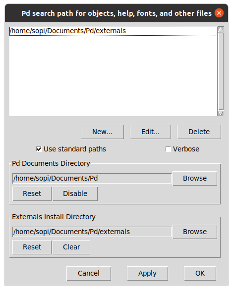
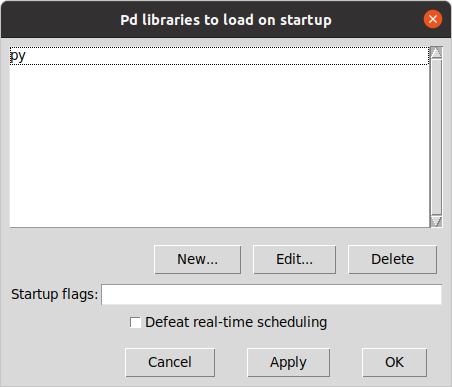

# pyext setup (Linux)

This guide is written for Ubuntu (version 20.04.1 LTS), but should be fairly simple to adapt to other distributions.

## Install prerequisites

Open a terminal and run:

```
sudo apt install ubuntustudio-installer git libasound2-dev libjack-jackd2-dev
```

## Set up real-time audio

Launch the Ubuntu Studio Installer and install the following packages:

- `ubuntustudio-audio` (optional, see note below)
- `linux-lowlatency`
- `ubuntustudio-menu`
- `ubuntustudio-lowlatency-settings`
- `ubuntustudio-performance-tweaks`

The `ubuntustudio-audio` package installs an assortment of audio software including Pure Data. If you just want Pd, you can skip this package and install Pd with:

```
sudo apt install puredata
```

## Clone the course repository

If you don't already have this repository on your computer, clone it:

```
git clone https://github.com/SopiMlab/DeepLearningWithAudio.git
```

This will download the repository into your current working directory, which in a new terminal window is usually your home directory.

## Install Conda

We will use the Conda package/environment manager to set up a Python environment. Install Miniconda following the [official Conda instructions](https://conda.io/projects/conda/en/latest/user-guide/install/linux.html). Note that you *only* need Miniconda! The instructions page is a bit confusing and makes it seem like you should install both Miniconda and Anaconda, but you can ignore the latter.

## Download Magenta

Enter the root directory of the course repository. For example, if you cloned it into your home directory:

```
cd ~/DeepLearningWithAudio
```

Now clone our Magenta repository:

```
git clone https://github.com/SopiMlab/magenta.git
```

## Install Magenta

Magenta can run either on CPU (widest hardware compatibility) or GPU (much better performance). Running on GPU requires a CUDA compatible NVIDIA GPU.

Create a Conda environment. The `-n` argument specifies the name of the environment and can be whatever you want, but we'll use "magenta" here:

For CPU:

```
conda create -n magenta python=3.7 tensorflow=1.15
```

For GPU:

```
conda create -n magenta python=3.7 tensorflow-gpu=1.15
```

This will ask you for confirmation, create a Python 3.7 environment and install some packages.

Activate the environment:

```
conda activate magenta
```

This should update your command line prompt to say `(magenta)` at the start.

Note that activating the Conda environment only applies to your current terminal window! If you open a  new window, you'll have to run this command again.

Enter the previously created Magenta directory:

```
cd magenta
```

Install Magenta into the Conda environment from the current directory using pip, Python's package manager:

```
pip install --use-feature=2020-resolver -e .
``` 

You should now see Magenta in the output of `pip list`:

```
pip list
```

Output (the version number may differ):

```
Package                            Version
---------------------------------- -----------
...
magenta                            1.3.0
...
```

## Install sopilib

Enter the `sopilib` directory:

```
cd ../utilities/sopilib
```

Install:

```
pip install --use-feature=2020-resolver -e .
```

## Install sopimagenta

Enter the `sopimagenta` directory:

```
cd ../sopimagenta
```

Install:

```
pip install --use-feature=2020-resolver -e .
```

## Build pyext

Enter the `pyext-setup` directory:

```
cd ../pyext-setup
```

Run the `build.py` script with the `--info` flag to check your environment:

```
python build.py --info
```

Output:

```
platform config: LinuxConfig
Python version: 3.7.9 (default, Aug 31 2020, 12:42:55)
[GCC 7.3.0]
Python executable: /home/sopi/miniconda3/envs/magenta/bin/python
Pd path: /usr/bin/pd
Conda root: /home/sopi/miniconda3/envs/magenta
```

The output on your system will differ a bit according to your corresponding paths.

Now build pyext by running the same command without `--info`:

```
python build.py
```

This creates a binary called `py.pd_linux` in the `build/py` subdirectory. It is normal for some warnings to appear during the build.

## Install pyext

Create a directory in your Documents for Pd externals:

```
mkdir -p ~/Documents/Pd/externals
```

(In case the directory already exists, this command will do nothing, so it's safe to run either way.)

Move `py.pd_linux` into the externals directory:

```
mv build/py/py.pd_linux ~/Documents/Pd/externals/
```

Start Pure Data. Go to File menu → Preferences → Path and make sure your externals directory is in the search path:



Then go to File menu → Preferences → Startup and add `py` to the libraries list:



Click OK, save your preferences (File menu → Preferences → Save All Preferences) and restart Pure Data. There should now be a message about pyext in the main window, e.g.:

```
------------------------------------------------
py/pyext 0.2.2 - python script objects
(C)2002-2019 Thomas Grill - http://grrrr.org/ext

using Python 3.7.9 (default, Aug 31 2020, 12:46:46) 
[GCC 7.3.0]

Python array support enabled
------------------------------------------------
```

Congratulations, you've got it working! You're now ready to run our Pd patches.