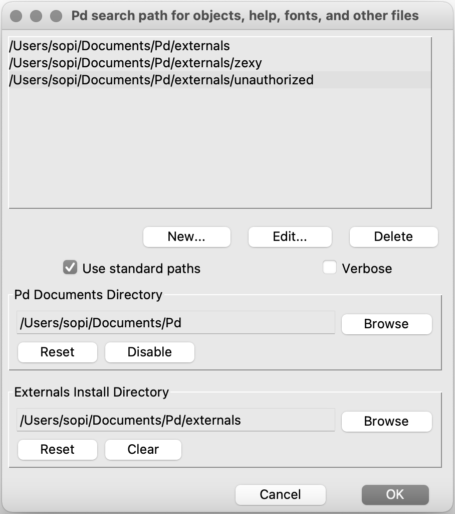
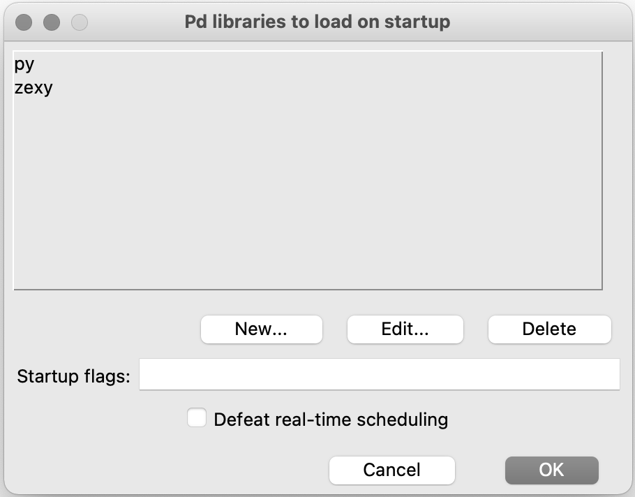

# pyext setup (macOS)

## Prerequisites

You should have [Pure Data](https://puredata.info/) installed. We've found Purr Data to be unreliable for this setup, so Pd Vanilla is preferred.

If you've never used the command line before, it may be a good idea to have a look at a [tutorial](https://macpaw.com/how-to/use-terminal-on-mac) first to learn some of the basics.

## Install required Pd externals

Some of our patches require the following externals:

- `list-abs`
- `unauthorized`
- `zexy`

Install these via Help menu → Find externals. Make sure the folders for `unauthorized` and `zexy` are in your search path (Pd menu → Preferences → Path…) and that `zexy` gets loaded on startup (Pd menu → Preferences → Startup…). There are screenshots at the end of this document showing an example of what these preferences should look like.

## Install Xcode command line tools

Apple's Xcode command line developer tools are required for setup. If you have the regular Xcode installed from App Store, the command line tools may already be included.

To install the command line tools, open Terminal and run:

```
xcode-select --install
```

This will pop up a dialog to guide you through the installation.

## Clone the course repository

If you don't already have this repository on your computer, clone it:

```
git clone https://github.com/SopiMlab/DeepLearningWithAudio.git
```

This will download the repository into your current working directory, which in a new terminal window is your home directory.

## Install Conda

We will use the Conda package/environment manager to set up a Python environment.

If you have [Homebrew](https://brew.sh), you can simply run:

```
brew install --cask miniconda
```

Otherwise, follow the [official Conda instructions](https://conda.io/projects/conda/en/latest/user-guide/install/macos.html). Note that you *only* need Miniconda! The instructions page is a bit confusing and makes it seem like you should install both Miniconda and Anaconda, but you can ignore the latter.

## Download Magenta

Enter the root directory of the course repository. For example, if you cloned it into your home directory:

```
cd ~/DeepLearningWithAudio
```

Now clone our Magenta repository:

```
git clone https://github.com/SopiMlab/magenta.git
```

## Install Magenta

Magenta can run either on CPU (widest hardware compatibility) or GPU (much better performance), but on macOS only the CPU variant is supported. This makes setup simpler, but it does mean performance is limited even if you happen to have an NVIDIA graphics card available.

Create a Conda environment. The `-n` argument specifies the name of the environment and can be whatever you want, but we'll use "magenta" here:

```
conda create -n magenta python=3.7 libopenblas=0.3
```

This will ask you for confirmation, create a Python 3.7 environment and install some packages.

Activate the environment:

```
conda activate magenta
```

This should update your command line prompt to say `(magenta)` at the start.

Note that activating the Conda environment only applies to your current terminal window! If you open a new window, you'll have to run this command again.

----

### Error: "Your shell has not been properly configured..."

The first time you run `conda activate`, you may get a message saying your shell has not been properly configured and instructing you to initialize. If so, run one of the following (depending on your macOS version) to configure the default shell:

macOS 10.14 and earlier:

```
conda init bash
```

macOS 10.15 and later:

```
conda init zsh
```

macOS Big Sur:

```
source <path to miniconda.... /base/bin/activate> for example source /usr/local/Caskroom/miniconda/base/bin/activate

conda init zsh
```

Then close and re-open the terminal, navigate to the `DeepLearningWithAudio` directory again and re-run the `conda activate` command above.

----

Enter the previously created Magenta directory:

```
cd magenta
```

Install Magenta into the Conda environment from the current directory using pip, Python's package manager:

```
pip install -e .
``` 

----

### Why `-e`?

Using `pip install` with the  `-e` flag installs in "editable mode". This means you can edit or update the Python code in the `DeepLearningWithAudio` repository and the changes will take effect without having to reinstall the package.

----

You should now see Magenta in the output of `pip list`:

```
pip list
```

Output (the version number may differ):

```
Package                            Version
---------------------------------- -----------
...
magenta                            2.1.3
...
```

## Clone the SopiLib repository

This repository contains some support libraries. Go back to the course root:

```
cd ..
```

Clone the repository:

```
git clone https://github.com/SopiMlab/SopiLib.git
```

## Install sopilib

Enter the `sopilib` subdirectory:

```
cd SopiLib/sopilib
```

Install:

```
pip install -e .
```

## Install sopimagenta

Enter the `sopimagenta` subdirectory:

```
cd ../sopimagenta
```

Install:

```
pip install -e .
```

## Build pyext

Enter the `pyext-setup` directory:

```
cd ../utilities/pyext-setup
```

Run the `build.py` script with the `--info` flag to check your environment:

```
python build.py --info
```

Output:

```
platform config: MacConfig
Python version: 3.7.10 (default, Feb 26 2021, 10:16:00)
[Clang 10.0.0 ]
Python executable: /usr/local/Caskroom/miniconda/base/envs/magenta/bin/python
Pd path: /Applications/Pd-0.51-3.app
Conda root: /usr/local/Caskroom/miniconda/base/envs/magenta
```

The output on your system will differ a bit according to your corresponding paths.

----

### Error: "No Pd found" or wrong Pd path

If the script fails to find your Pd path, or finds the wrong version, you can specify it manually with the `--pd` option:

```
python build.py --info --pd /Users/miranda/SomeUnusualPdFolder/Pd-0.50-0.app
```

Output:

```
platform config: MacConfig
Python version: 3.7.10 (default, Feb 26 2021, 10:16:00)
[Clang 10.0.0 ]
Python executable: /usr/local/Caskroom/miniconda/base/envs/magenta/bin/python
Pd path: /Users/miranda/SomeUnusualPdFolder/Pd-0.50-0.app
Conda root: /usr/local/Caskroom/miniconda/base/envs/magenta
```

----

Now build pyext by running the same command without `--info` (keep the `--pd` option if you needed to add it before):

```
python build.py
```

This creates a binary called `py.pd_darwin` in the `build/py` subdirectory. It is normal for some warnings to appear during the build.

## Install pyext

Create a directory in your Documents for Pd externals:

```
mkdir -p ~/Documents/Pd/externals
```

(In case the directory already exists, this command will do nothing, so it's safe to run either way.)

Move `py.pd_darwin` into the externals directory:

```
mv build/py/py.pd_darwin ~/Documents/Pd/externals/
```

Start Pure Data. Go to Pd menu → Preferences → Path and make sure your externals directory is in the search path:



Then go to Pd menu → Preferences → Startup and add `py` to the libraries list:



Click OK, save your preferences (Pd menu → Preferences → Save All Preferences) and restart Pure Data. There should now be a message about pyext in the main window, e.g.:

```
------------------------------------------------
py/pyext 0.2.2 - python script objects
(C)2002-2019 Thomas Grill - http://grrrr.org/ext

using Python 3.7.7 (default, Mar 26 2020, 10:35:24) 
[Clang 4.0.1 (tags/RELEASE_401/final)]

Python array support enabled
------------------------------------------------
```

Congratulations, you've got it working! You're now ready to run our Pd patches.

## Updating the repository

We may sometimes make changes to the course repository. To obtain the changed files, you could re-download the whole `DeepLearningWithAudio` repository. Alternatively, you can use Git to pull the changes to your existing local copy of the repository. To do this, make sure you're in the `DeepLearningWithAudio` folder and run:

```
git pull
```

This may give you some errors if you've made your own modifications to the files being updated. How to "properly" resolve such conflicts with Git is outside the scope of this course. Instead you can just make copies of your changed files with new filenames, and then run:

```
git reset --hard
```

to remove your changes from the original files. Then run `git pull` again.
